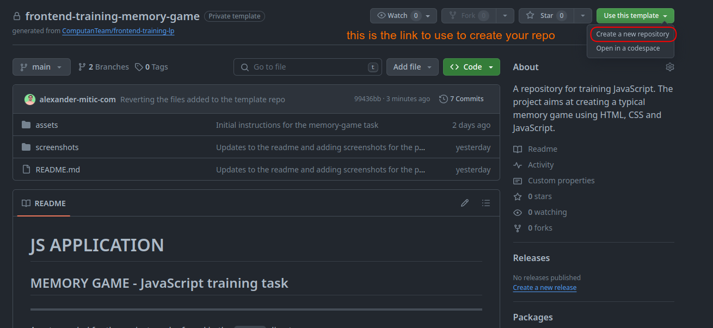
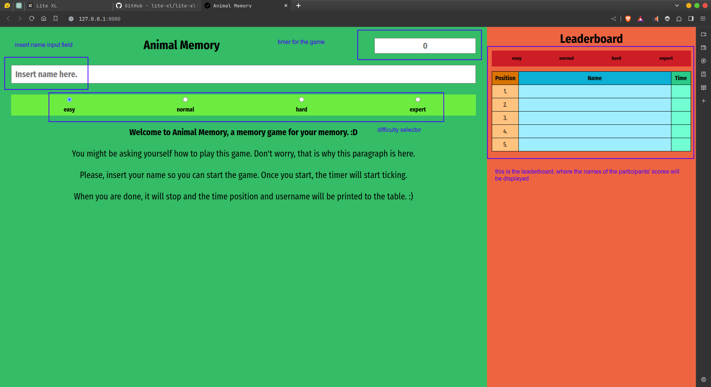
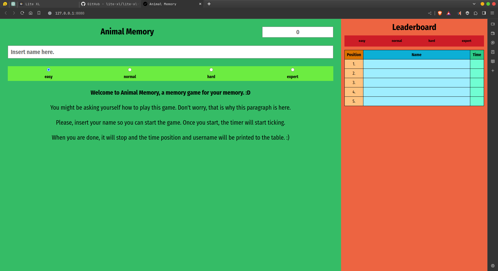
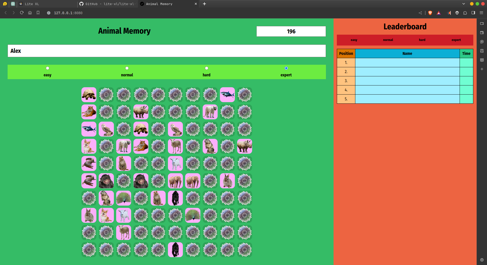
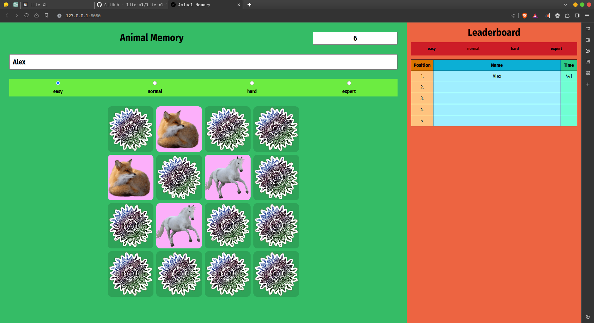
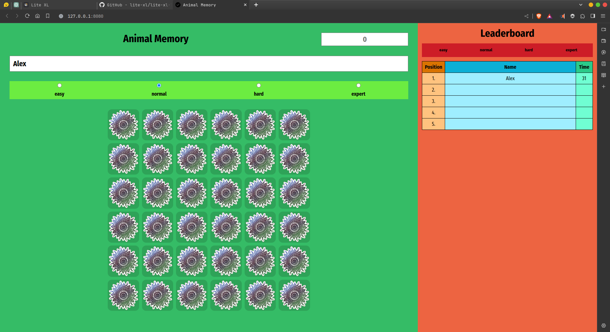
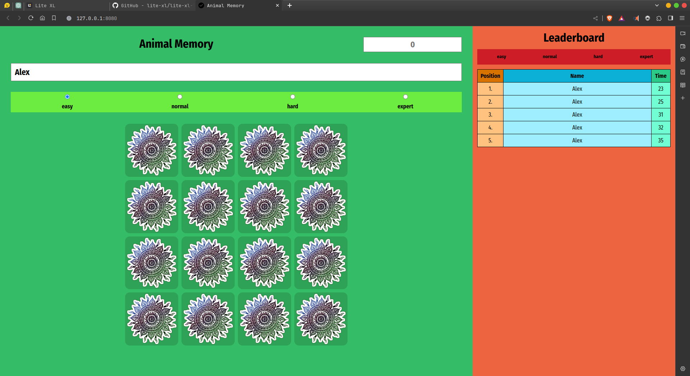
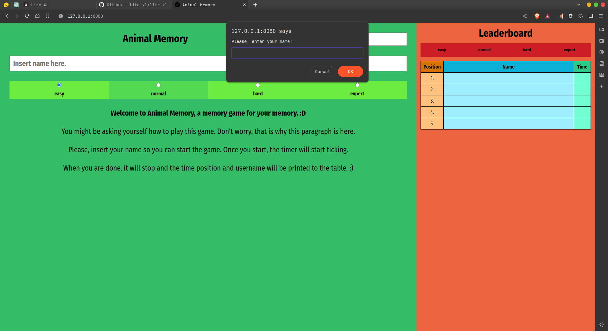
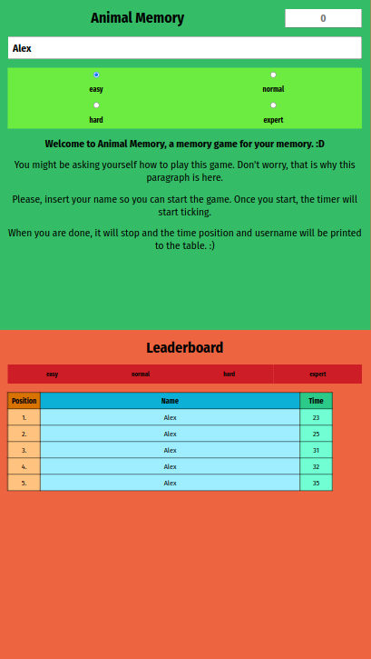

# MEMORY GAME

## JavaScript training task

---

**DO NOT PUSH YOUR CODE HERE!**

Use this repo as a template to create your repository.

See the image bellow:

---

Assets needed for the project can be found in the `assets` directory.

Screenshots of the project can be found in the `screenshots` directory or down bellow [Go to Section](#screenshots).

---

## INSTRUCTIONS

Your task is to create a "Memory Game" in JavaScript. The objectives you need to accomplish are outlined in the following text. Your applications should be functional and meet the specified criteria. Only after satisfying all the criteria can you add additional features.

You have the freedom to use any style you want in the project, but there are general rules you must follow, also mentioned in the objectives.

### TASKS

To start the memory game, the player needs to enter their username:

*   The username must not be an empty string or null value. If they don't enter a valid username, display a notification.
*   By pressing the enter key in the input field, the player confirms their username, which is recorded in local memory and remains in the input until changed.

The player can choose the difficulty level of the game. The difficulty level is selected by clicking on a radio button, where the easiest level is default:

| **Level** | **Table Dimension** | **Number of Cards** | **Number of Card Pairs** |
| --- | --- | --- | --- |
| Easy | 4 x 4 | 16 | 8 |
| Medium | 6 x 6 | 36 | 18 |
| Hard | 8 x 8 | 64 | 32 |
| Expert | 10 x 10 | 100 | 50 |

The game board consists of randomly arranged pairs of cards. Depending on the selected difficulty level, the board has a different number of cards. A new random permutation of cards is generated each time the game starts.

The game begins when the cards are arranged on the board. Initially, only the backs (the reverse side of the cards) are visible, and the player's task is to find pairs of matching cards as quickly as possible.

At the start of each new game, the timer is reset. The time is counted from zero (in seconds) until the player finds all pairs of matching cards.

The player "flips" a card by clicking on it, revealing the image behind its reverse side. In one move, the player can only "flip" two cards (one at a time):

*   If the flipped cards are a pair, their images remain visible to the player.
*   If the flipped cards are not a pair, they are turned back to their reverse side, and the player continues guessing.

The game ends when the player uncovers all pairs of cards. After the game is completed, a notification appears on the screen, asking the user to confirm if they want to start a new game.

If the user wants to start a new game, a new randomly selected permutation of cards is generated and displayed on the screen. The time starts again from 0 seconds, and the player can start a new game.

If the user doesn't want to start a new game, the "open cards" and the time achieved at the moment of opening all cards remain displayed on the screen.

Players have access to a table of the best results. Each category has its table with the top 5 players. Each player is recorded as an object with attributes:

*   Username
*   Time Achieved
*   Difficulty Level

The same username of a player can appear multiple times in one category (a player can enter the top results table multiple times).

All tables with their data remain even after refreshing the page.

Your website should be responsive:

*   In desktop format, the Memory Game and the Best Results table should be arranged side by side.
*   In tablet format, the Memory Game and the Best Results table should be arranged one below the other.
*   In mobile format, adopt the design from the tablet format, only buttons for selecting results should span 50% of the page width.

### ADDENDUM:

Explanation of how to create a random permutation of an array:

Assuming we have an array with n elements and we want to create a random permutation of that array, i.e., arrange the elements in a random order.

We start from the last element of the array, going down to the second element, applying the following principle: Each i-th element of the array can stay in its place in the array or be replaced with any element to its left in the array, i.e., with any element from the first to the (i - 1)-th element.

In other words, we can say that the i-th element can be replaced with any element from the first to the i-th element because if an element exchanges places with itself, it means that the element stays in its place in the array. Therefore, the element with index n - 1 is replaced with any element with an index in the range {0, 1, 2, ..., n - 3, n - 2, n - 1}.

Then, the element with index n - 2 is replaced with any element with an index in the range {0, 1, 2, ..., n - 3, n - 2}.

This process is repeated until we reach the element in the array with index 1. It can be replaced either with the element with index 0 (i.e., swapping the first and second elements in the array) or with the element with index 1 (i.e., both elements in the array remain in their place).

Applying this process, we get a random arrangement of elements in the given array.

If this was confusing, check the video for an explanation: https://www.youtube.com/watch?v=myL4xmtAVtw

## Screenshots

Good luck remembering all this! 😀️